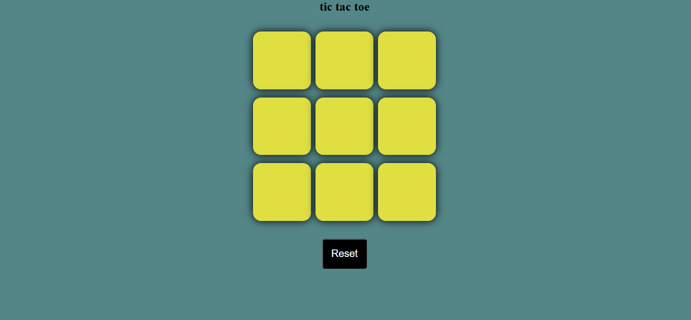

# ❌⭕ Tic Tac Toe – A Two-Player JavaScript Game

A simple **Tic Tac Toe** game for two players, built using **HTML, CSS, and JavaScript**. Players take turns marking spaces in a 3×3 grid until one wins or the game ends in a draw.  

## 🚀 Features  
✅ Two-player mode (alternating turns)  
✅ Detects win, loss, or draw  
✅ Reset button to restart the game  
✅ Simple and responsive UI  

## 📸 Screenshot  
 *(Replace with an actual screenshot of your game)*  

## 🎮 How to Play?  
1. **Player 1** starts with **X**, and **Player 2** plays as **O**.  
2. Click on an empty box to place your mark.  
3. The first player to get **three in a row** (vertically, horizontally, or diagonally) wins!  
4. If all boxes are filled and no one wins, it's a **draw**.  
5. Click the **Reset** button to play again!  

## 💻 How to Run?  
1. Clone the repository:  
   ```bash
   git clone https://github.com/SagarDevop/tic-tac-toe.git

🌐 Live Demo
Live Demo Here (http://127.0.0.1:5501/index.html)

🛠 Technologies Used
HTML – Game structure

CSS – Styling & animations

JavaScript – Game logic

📌 Project Structure
bash
Copy
Edit
tic-tac-toe/
│── index.html      # Main HTML file
│── style.css       # CSS for styling
│── script.js       # JavaScript logic
│── README.md       # Project documentation
└── screenshot.png  # Preview image (optional)
🤝 Contributing
Feel free to fork this repository and add features like an AI opponent, score tracking, or sound effects!

📜 License
This project is open-source under the MIT License.   
